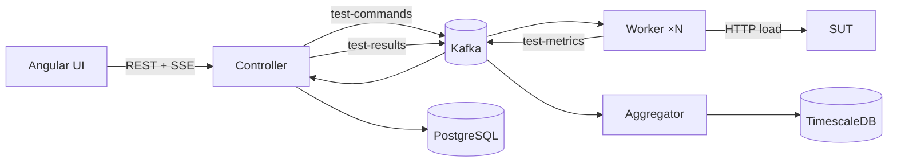

# load-lab

[](https://github.com/virael/load-lab/actions/workflows/ci.yml)
[](https://github.com/virael/load-lab/releases)
[](LICENSE)

A distributed load-testing platform — built primarily as a hands-on system design
learning project. A controller orchestrates a fleet of workers that generate HTTP
load against a target service, streaming latency, throughput, and error metrics
back in real time.

The codebase grew in deliberate phases — from a single-process MVP to a
queue-coordinated, horizontally scalable system with a full metrics pipeline —
with CI/CD woven in from the first commit.

## Architecture



| Service      | Role                                                                                                                                                             | Port |
| ------------ | ---------------------------------------------------------------------------------------------------------------------------------------------------------------- | ---- |
| `controller` | REST API, splits load across workers, merges results (real HdrHistogram merging — not averaged percentiles), streams live updates via SSE, persists test history | 8080 |
| `sut`        | Configurable target with tunable latency range and error rate                                                                                                    | 8081 |
| `worker`     | Generates load via a reactive `WebClient` engine, measures latency, publishes metrics back through Kafka                                                         | 8082\* |
| `aggregator` | Consumes merged results, computes time-windowed deltas, persists to TimescaleDB                                                                                  | 8083 |
| `web`        | Angular dashboard — live test view, history, side-by-side run comparison                                                                                         | —    |

\* Not host-published when scaled beyond one replica (`--scale worker=N`) —
reachable from other containers on the compose network, not directly from
the host.

## Tech stack

**Backend:** Java 21, Spring Boot 4.1.0, Spring Kafka, Spring WebFlux (worker's load-generation engine), HdrHistogram, Flyway
**Frontend:** Angular 22.0.7, Signal Forms, SSE
**Infrastructure:** Kafka (KRaft), PostgreSQL, TimescaleDB, Docker (multi-stage, layered jars), Kubernetes via Helm, KEDA
**CI/CD:** GitHub Actions, Testcontainers, JaCoCo, commitlint + Conventional Commits, release-please, `github-action-benchmark`

## Quick start (local)

```bash
cd deploy
docker compose up --build --scale worker=3 --wait
```

```bash
curl -X POST localhost:8080/tests \
  -H "Content-Type: application/json" \
  -d '{"targetUrl":"http://sut:8081/simulate","virtualUsers":30,"durationSeconds":15}'
```

The response contains the test ID and its initial state:

```json
{"id":"<id>","status":"PENDING","totalRequests":0,"avgLatencyMs":0.0,"errors":0,"p50Ms":0,"p95Ms":0,"p99Ms":0}
```

```bash
curl -N localhost:8080/tests/<id>/stream
```

The stream emits Server-Sent Events in this format:

```text
event:snapshot
data:{"id":"<id>","status":"RUNNING","totalRequests":210,"avgLatencyMs":85.10952380952381,"errors":0,"p50Ms":56,"p95Ms":237,"p99Ms":250}
```

Or open `web/` (`ng serve`) for the dashboard.

> **Note:** the `loadlab`/`loadlab` credentials in `docker-compose.yml` and
> `deploy/helm/load-lab/values.yaml` are demo-only placeholders, not intended
> for any real deployment.

## Deploying

```bash
helm install load-lab deploy/helm/load-lab \
  --namespace load-lab --create-namespace \
  --set image.owner=OWNER
```

See [`deploy/helm/load-lab/values.yaml`](deploy/helm/load-lab/values.yaml) for
autoscaling options — KEDA (scales workers on Kafka consumer lag, the default)
or a CPU-based HPA (kept as a deliberate counter-example: CPU is a poor signal
for a load generator).

## Testing & CI

Every PR runs: unit + integration tests (Testcontainers-backed Kafka/Postgres/
TimescaleDB) for all four backend services, frontend lint/build/test, a
full multi-worker `docker compose` smoke test, Helm chart validation, and a
performance regression gate comparing the worker's reactive load engine
against a recorded CI-runner baseline. See [`.github/workflows/`](.github/workflows/).

## What this project explores

A handful of the concrete lessons this codebase was built to demonstrate,
not just describe:

- **Percentiles can't be averaged across machines.** The controller merges
  raw HdrHistogram data from every worker before computing p50/p95/p99 —
  see `HistogramMerger` and the test that proves what's lost without it.
- **A message queue doesn't give fault tolerance for free.** Kafka commits
  offsets on receipt, not on completion — the controller runs its own
  watchdog to detect and redispatch work from a worker that dies mid-run.
- **Backpressure isn't one problem.** Four different hops in this system
  need four different protections — three come free from Kafka's pull
  model, the fourth (SSE to the browser) needed an explicit, tested
  conflating relay.
- **Reactive isn't automatically faster.** At 500 VU the worker's thread-per-VU
  and reactive engines are within noise of each other; at 3000 VU thread-per-VU
  was actually *faster* on this hardware (20,213 vs 17,331 req/s, p99 305 vs
  387 ms). Reactive's measured, decisive win is elsewhere — a flat ~18-thread
  footprint at any concurrency versus 3,143 OS threads for thread-per-VU. No
  throughput crossover appeared by 3000 VU. See
  `docs/phase-7-benchmark-results.md` for the numbers.

## License

[Apache License 2.0](LICENSE)
